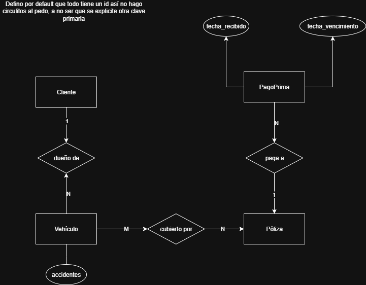

## Ejercicio 1.1
Una compañía de seguros de automóviles tiene clientes que pueden poseer uno o más vehículos cada uno. Cada vehículo tiene asociado cero a cualquier número de accidentes registrados. Cada póliza de seguro cubre uno o más vehículos, y tiene uno o más pagos de las primas asociadas con ella. Cada pago es por un período de tiempo determinado , y tiene una fecha de vencimiento asociada, y la fecha en que se recibió el pago. Discuta diferentes alternativas de vinculación entre póliza y vehículo.

### Pasaje a MR
**Cliente**(<u>idCliente</u>) 
PK=CK={idCliente}

**Vehiculo**(<u>idVehiculo</u>, idCliente, accidentes) 
PK = CK = {idVehiculo} 
FK = {idCliente}

**Póliza**(<u>idPoliza</u>) 
PK=CK={idPoliza}

**VehiculoPoliza (cubierto por)**(<u>idPoliza,idVehiculo</u>) 
PK=CK={(idPoliza,idVehiculo)} 
FK={idPoliza, idVehiculo}

**PagoPrima**(<u>idPago</u>, fecha_recibido, fecha_vencimiento, idPoliza) 
PK=CK={idPago}
FK={idPoliza}

