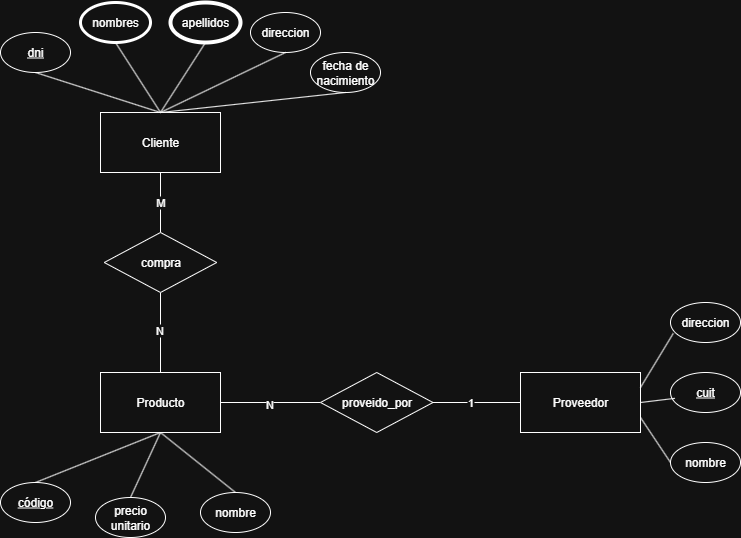

## Ejercicio 1.2

Una empresa vende productos a varios clientes. Se precisa conocer los datos personales de los clientes (nombres, apellidos, dni, dirección y fecha de nacimiento). Cada producto tiene un nombre y un código, así como un precio unitario. Un cliente puede comprar varios productos a la empresa, y un mismo producto puede ser comprado por varios clientes. Los productos son suministrados por diferentes proveedores. Se debe tener en cuenta que un producto sólo puede ser suministrado por un proveedor, y que un proveedor puede suministrar diferentes productos. De cada proveedor se desea conocer el CUIT, nombre y dirección.

**NOTA**: Esto **NO** especifica que el cliente pueda comprar el MISMO producto varias veces. Comprendo que esto es surrealista y poco verosímil, pero voy a usarlo a mi favor para simplificar el modelo, con una simple relación M:N entre cliente y producto. De esta manera, cualquier cliente puede tener cualquier producto, una sola vez. En caso de que fuese especifica que el mismo cliente puede comprar el mismo producto varias veces en distintas ocasiones, crearia una entidad intermedia llamada "Venta". El resto es intuitivo.

**NOTA**: Me olvide de poner participación, así qe no asumas q no todo es participación total! Tanto cliente como producto pueden no participar de la compra

### Pasaje a MR

**Cliente**(<u>dni</u>, etc) 
PK = CK = {dni}

**Producto**(<u>codigo</u>, precio_unitario, nombre, cuitProveedor) 
PK = CK = {codigo}

**Compra**(<u>dni,codigo</u>) 
PK = CK = {(dni,codigo)} 
FK = {dni, codigo}

**Proveedor**(<u>cuit</u>, direccion, nombre) 
PK=CK={cuit}

