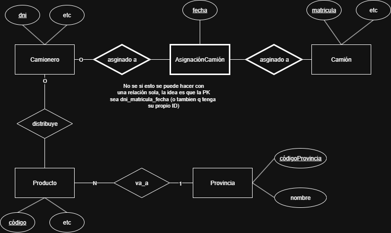

## Ejercicio 1.3

Se desea informatizar la gestión de una empresa de transportes que reparte paquetes por todo el país. Los encargados de llevar los paquetes son los camioneros, de los que se quiere guardar el dni, nombre, apellido, teléfono, dirección, salario y población en la que vive. 
De los paquetes transportados interesa conocer el código de paquete, descripción,
destinatario y dirección del destinatario. Un camionero distribuye muchos paquetes,y un paquete sólo puede ser distribuido por un camionero. 
De las provincias a las que llegan los paquetes interesa guardar el código de provincia y el nombre. Un paquete sólo puede llegar a una provincia. Sin embargo, a unaprovincia pueden llegar varios paquetes. 
De los camiones que llevan los camioneros, interesa conocer la matrícula, modelo,
tipo y potencia. Un camionero puede conducir diferentes camiones en fechas diferentes, y un camión puede ser conducido por varios camioneros.

### Pasaje a MR

me ahorro estilos pq me da paja

**Camionero**(dni, etc) 
PK=CK={dni}

**Camión**(matricula, etc) 
PK=CK={matricula}

**Asignación**(<u>matricula, dni, fecha</u>) 
PK=CK={(matricula, dni, fecha)}
FK={matricula, dni}

**Producto**(código, etc) 
PK=CK={código}
FK={códigoProvincia}

**Provincia**(códigoProvincia, etc) 
PK=CK={códigoProvincia}
