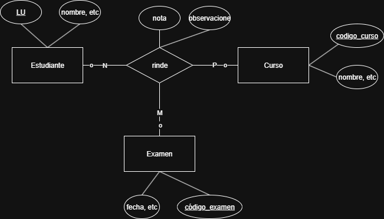

## Ejercicio 1.4

Considere una base de datos que registra los resultados obtenidos por los estudiantes en diferentes exámenes de diferentes cursos realizados.
### (a) Construya el DER y MR suponiendo que Examen es una entidad y utilizando relaciones ternarias.

#### Pasaje a MR

**Estudiante**(<u>legajo</u>, nombre, apellido, email) 
PK=CK={legajo}

**Curso**(<u>cod_curso</u>, nombre, docente) 
PK=CK={cod_curso}

**Examen**(<u>cod_examen</u>, fecha, tipo) 
PK=CK={cod_examen}

**Rinde**(<u>cod_examen, cod_curso, legajo</u>, nota, observaciones) 
PK=CK={(cod_examen, cod_curso, legajo)} 
FK={cod_examen, cod_curso, legajo}

### (b) Construya una alternativa usando sólo una relación binaria entre Estudiante y Curso. Asegúrese de que sólo existe una relación entre un estudiante en particular y un curso, pero puede representar los resultados que un estudiante obtiene en diferentes exámenes.

Entiendo que acá la idea es borrar la linea que lleva a examen, y después armar un agregado entre la relación binaria de estudiante y curso, que se relacione con examen. Es masomenos lo mismo.