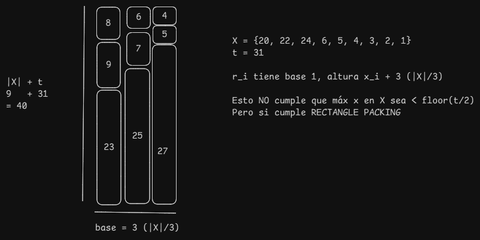

## Considerar los siguientes lenguajes:

### 2-PARTITION = {$⟨X⟩ : X$ es un subconjunto finito de los números naturales con $min_{x \in X}(x)$ > 2 que se puede particionar en dos conjuntos $X_1, X_2$ tales que $X_1 ∩ X_2 = ∅$, $X_1 ∪ X_2 = X$ y $\sum_{x\in X_1} x = \sum_{x\in X_2} x$}

### 3-PARTITION = { $⟨X, t⟩ : X$ es un subconjunto finito de los números naturales tal que $\sum_{x \in X} x = \frac{|X| \cdot t}{3}$, $\max_{x \in X} x < \left\lfloor \frac{t}{2} \right\rfloor$, y X se puede particionar en $\frac{|X|}{3}$ triplas donde cada una suma $t$ }

### RECTANGLE-PACKING = {$⟨R, r_1, . . . , r_k⟩$ : R es un rectángulo que se puede cubrir completamente y sin superposición usando los rectángulos $r_1, . . . , r_k$ con traslaciones y/o rotaciones}

### a)
Dada una instancia ⟨X⟩ de 2-PARTITION, se define la instancia $⟨R, r_1, \ldots, r_{|X|}$⟩ de RECTANGLE PACKING donde $R$ tiene base $\sum_{x \in X} \frac{x}{2}$ y altura $2$, y $r_i$ es un rectángulo de base $x_i$ y altura $1$, para cada $1 \leq i \leq |X|$. 

Demostrar que $\langle X \rangle \in \text{2-PARTITION} \iff \langle R, r_1, \ldots, r_{|X|} \rangle \in \text{RECTANGLE-PACKING}$.

$\Rightarrow$) Vamos a ver que puedo deducir. Lo primero, la base de R es la suma de los x/2. Recordemos que X se puede dividir en 2 conjuntos disjuntos que suman todos lo mismo. Entonces, como $r_i$ tiene altura 1. Simplemente tomo $X_1$ para formar la "linea" de abajo y $X_2$ para la "linea" de arriba.

(NOTA: formalizar un poquito mas)

$\Leftarrow$) Medianamente equivalente. Sabemos que el rectangulo tiene width sum(X)/2. De esta manera, se puede decir que la distribucion del rectangulo tiene todos los $r_i$ tal que $x_i \in X_1$ para la "linea" de arriba, y los j en $X_2$ para la de abajo. Entonces, sabemos que $X_1$ y $X_2$ no comparten elementos, ya que se puede ver ambas lineas como elementos disjuntos, y ambos tienen el mismo largo, y su suma es la suma de $X$. Entonces, $X \in \text{2-PARTITION}$ 

### b)

Dada una instancia ⟨X, t⟩ de **3-PARTITION**, se define la instancia 
$⟨R, r_1, \ldots, r_{|X|}⟩$ de **RECTANGLE PACKING** donde:

- $R$ tiene base $\frac{|X|}{3}$ y altura $t + |X|$,
- $r_i$ es un rectángulo de base 1 y altura $\frac{|X|}{3} + x_i$, para cada $1 \leq i \leq |X|$.

Demostrar que: $(X, t) \in \text{3-PARTITION} \iff (R, r_1, \ldots, r_{|X|}) \in \text{RECTANGLE PACKING}$

El problema es totalmente incomprensible, pero leyendolo bien sale.
Veamos la ida.

$\Rightarrow$) Vamos a poner esto en palabras reales. Dado que $(X, t)$ es 3-part, sabemos que puedo formar $\frac{|X|}{3}$ triplas. Que gano con esto? Tenemos que llenar la base y la altura. Cada uno de los $r_i$ tienen base 1. Sabemos que hay $\frac{|X|}{3}$ triplas, entonces cada tripla va a ser una "columna". Las columnas van a ir pegadas una al lado de la otra, todas con ancho 1, entonces llenan el ancho. Bien, como llenamos el alto? Sabemos que la altura es $t + |X|$. Cada $r_i$ tiene de altura $|X|/3 + x_i$. Si subdividimos $X$ en las triplas, asumamos una tripla aleatoria, $(x_i, x_j, x_k)$. Sabemos que la suma de las 3 da $t$.
Entonces, la altura sumada de $(r_i, r_j, r_k)$ es de $t + 3*\frac{|X|}{3}$, es decir, $t + |X|$. Con eso, llenamos la altura, y generamos todo el rectángulo. Y se prueba verdadero.

$\Leftarrow$) La vuelta es un poco más complicada. Vamos a ver punto por punto

#### Si $⟨R, r_1, \ldots, r_{|X|}⟩ \in$ **RECTANGLE PACKING**, $\sum_{x \in X} x = \frac{|X| \cdot t}{3}$:
Esto se ve comparando las áreas del rectángulo y la de los rectángulitos. El área de $R$ es:
$$\frac{|X|}{3} \cdot (t+|X|) = \frac{|X|}{3} \cdot t + \frac{|X|}{3} \cdot |X|$$
Ahora, veamos el área sumada de los rectángulitos (que, por definición de $\text{RECTANGLE-PACKING}$, es el mismo número!)
$$|X|\cdot\frac{|X|}{3}\cdot\sum_{x \in X}x_i$$
Ya que la base es 1, es la suma de las alturas. Como hay $|X|$ rectangulitos, el $|X|/3$ sale multiplicando por $|X|$ y queda así. Entonces podemos afirmar que $\sum_{x \in X}x_i = \frac{|X|}{3} \cdot t$, como queríamos ver. Sigamos.

#### Si $⟨R, r_1, \ldots, r_{|X|}⟩ \in$ **RECTANGLE PACKING**, $\max_{x \in X} x < \left\lfloor \frac{t}{2} \right\rfloor$:

Vale este contraejemplo??? consultar!

###

