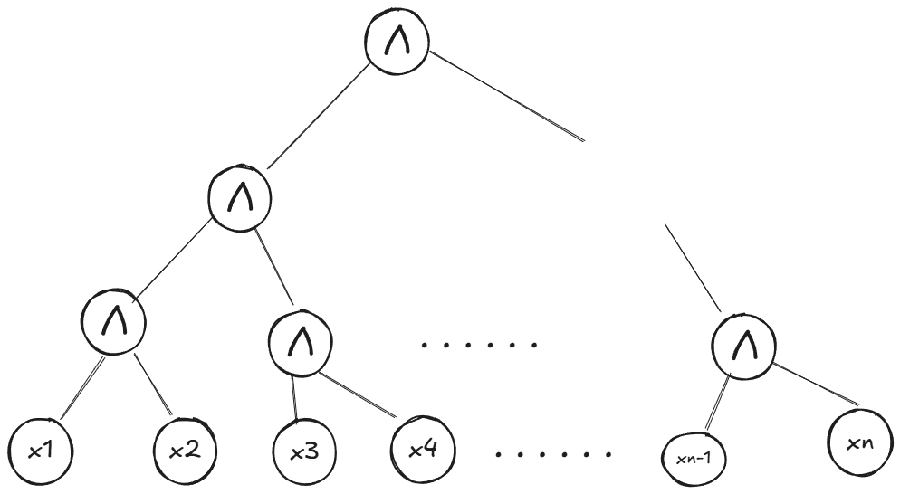

## Ejercicio 9

Ver que está en NC 1. Recordemos que $\text{NC}^1$ es la clase de lenguajes decidibles por una familia $\text{L}$-uniforme de circuitos $(C_n)_{n \in \mathbb{N}}$, en la que el largo de $C_n$ es polinomial y la profundidad de cada circuito tiene tamaño $O(\log\, n)$. 

#### $\text{AND} = \{x_1\dots x_n: \forall \,1 \leq i \leq n, \; x_i = 1\}$
#### $\text{OR} = \{x_1\dots x_n: \exists \,1 \leq i \leq n, \; x_i = 1\}$

Justo ver estos dos es trivial. Pensá en un arbol así:

Eso sería para AND, para or es lo mismo. Por que tiene profundidad log n? porque estamos en NC, entonces el fan in de los and y or es de 2. si tenemos un arbol que por cada "paso" se abre en dos ramas, tenemos log n "pasos".

Con esto podemos concluir que $\text{AC}^d \subseteq \text{NC}^{d+1}$, ya que el problema AND y el problema OR es literalmente como funcionarian el AND y el OR en AC0, con un fan in arbitrario. Se puede explicar mejor, pero yo entendí.