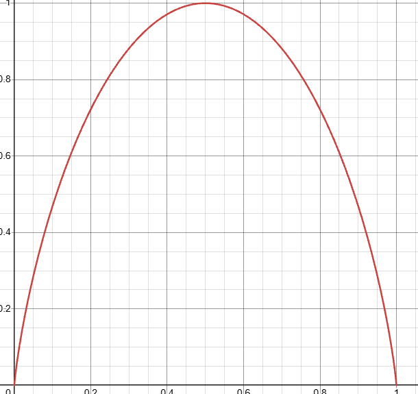

# Guía 1 — Transmisión confiable de información

*Redes de Comunicaciones y Cómputo Distribuido — FCEN, UBA*

hecha por mí, formateada por mi brother Sonnet o Luna o quien me re pinte

## Ejercicio 1

### a)

$$H(p_0) = p_0 \log_2\frac{1}{p_0} + (1-p_0)\log_2\frac{1}{1-p_0} = -p_0\log_2 p_0 - (1-p_0)\log_2(1-p_0)$$

### b)

### c)

Es bastante directo: si ambos símbolos tienen la misma probabilidad (p₀ = 0.5), ahí está el $H_{max}$.

## Ejercicio 2

*Resuelto en clase — mismo enunciado que la Práctica 1, Ejercicio 1.*

## Ejercicio 3

Es fácil ver que, cuando $N$ es potencia de 2, todos los símbolos quedan con la misma longitud y por lo tanto $L(C) = H(S)$. Como los símbolos son equiprobables, $H(S) = \log_2(N)$ siempre, con $N$ = cantidad de símbolos.

Si $N$ no es potencia de 2, armás el Huffman a ojo y contás cuántos símbolos quedan con cada longitud.

- **a)** $H(S) = L(C) = \log_2(2) = 1$ bit

- **b)** $H(S) = L(C) = \log_2(4) = 2$ bits

- **c)** 6 no es potencia de 2 → quedan 2 símbolos con 2 bits y 4 símbolos con 3 bits.

  $H(S) = \log_2(6) = 2.585$ bits, pero $L(C) = \dfrac{2\cdot2 + 4\cdot3}{6} = 2.667$ bits.

- **d)** $H(S) = L(C) = \log_2(8) = 3$ bits

- **e)** 10 no es potencia de 2 → quedan 6 símbolos con 3 bits y 4 símbolos con 4 bits.

  $H(S) = \log_2(10) = 3.322$ bits, pero $L(C) = \dfrac{6\cdot3 + 4\cdot4}{10} = 3.4$ bits.

- **f)** $H(S) = \log_2(N)$, siempre.

  Para $L(C)$: si $N$ es potencia de 2, $L(C) = \log_2(N)$.
  Si no, con $k = \lfloor \log_2 N \rfloor$ y $m = N - 2^k$ (los símbolos "que sobran"), quedan $2m$ símbolos de largo $k+1$ y $2^k - m$ símbolos de largo $k$.

## Ejercicio 4

### 1.

No, a ojo. No es equiprobable porque $b_1, \dots, b_m$ tienen probabilidad $1/32$ de salir, y los $a$ tienen $1/16$.

### 2.

No, tampoco. Tienen la misma cantidad de símbolos en cada lado, pero las probabilidades generales no son equitativas.

### 3.

Tampoco. No me dan las cuentas, pero cada símbolo de $a$ tiene probabilidad $1/32$ y cada símbolo de $b$ tiene $3/64$ (creo).

### 4.

Este, finalmente, sí. La probabilidad para cualquier componente de $A$ es $2/96$, es decir, $1/48$, y la de $b$ también es $1/48$.

## Ejercicio 5, 6

Hecho en clase.

## Ejercicio 7

### a)

La velocidad de transmisión es $V_{tx}=100$ Mbps, por lo que el tiempo de
transmisión de un bit es:

$$T_{tx}(1)=\frac{1}{100\cdot10^6}=10\ \text{ns}$$

El tiempo de propagación es:

$$T_{prop}=\frac{D}{V_{prop}}=\frac{385000\ \text{km}}{300000\ \text{km/s}}
\approx 1.2833\ \text{s}$$

Por lo tanto:

$$Delay(1)=T_{tx}(1)+T_{prop}\approx 1.2833\ \text{s}$$

$$RTT=2\cdot Delay(1)\approx 2.5667\ \text{s}$$

### b)

La capacidad de volumen es:

$$C_{vol}=Delay(1)\cdot V_{tx}$$

$$C_{vol}\approx 1.2833\cdot100\cdot10^6
\approx 128.33\ \text{Mbit}$$

Es decir, entran aproximadamente **128,33 millones de bits** simultáneamente
en el canal.

### c)

El tiempo de transmisión del pedido de 2 kbit es:

$$T_{tx,pedido}=\frac{2000}{100\cdot10^6}=20\ \mu\text{s}$$

El tiempo de transmisión de la imagen de 25 Mbit es:

$$T_{tx,imagen}=\frac{25\cdot10^6}{100\cdot10^6}=0.25\ \text{s}$$

Desde que se inicia el pedido hasta que termina de recibirse la imagen
transcurren:

$$T=T_{tx,pedido}+T_{prop}+T_{tx,imagen}+T_{prop}$$

$$T\approx0.00002+1.2833+0.25+1.2833
\approx 2.8167\ \text{s}$$

El tiempo mínimo es, entonces, aproximadamente **2,817 segundos**.

## Ejercicio 8, 9, 10 
hechos en clase

## Ejercicio 11

*Convención (ver diapo "Recordatorio" de ptoapto.pdf): el "delay" dado en el enunciado (0.25 s) es $T_{prop}$, no $Delay(Frame)$ — salvo que se diga lo contrario. $Delay(Frame) = T_{tx}(Frame) + T_{prop}$ y $RTT(Frame) = 2\cdot Delay(Frame)$.*

Datos reales por frame: es Stop & Wait de largo fijo, con CRC de 16 bits. Para distinguir 2 frames consecutivos ($SWS=RWS=1$, $\#frames \ge 2$) alcanza con **1 bit de SEQ**. Entonces:

$$|Datos| = 2000 - 16 - 1 = 1983\ \text{bits}$$

Para mandar 20 Mbit de datos:

$$\#frames = \left\lceil\frac{20\cdot10^6}{1983}\right\rceil = 10086\ \text{frames}$$

### a)

$$T_{tx}(Frame) = \frac{2000}{1\cdot10^6} = 2\ \text{ms}$$

$$Delay(Frame) = T_{tx}(Frame) + T_{prop} = 0.002 + 0.25 = 0.252\ \text{s}$$

$$RTT(Frame) = 2\cdot Delay(Frame) = 0.504\ \text{s}$$

Como es Stop & Wait, cada frame necesita su ciclo completo de ida y vuelta antes de mandar el siguiente:

$$T_{total} = 10086 \cdot 0.504 \approx 5083.3\ \text{s} \approx \mathbf{84.7\ minutos}$$

### b)

Mismo delay (0.25 s), ahora con $V_{tx}=1$ Gbps:

$$T_{tx}(Frame) = \frac{2000}{1\cdot10^9} = 2\ \mu\text{s}$$

$$Delay(Frame) = 0.000002 + 0.25 = 0.250002\ \text{s} \qquad RTT(Frame) \approx 0.500004\ \text{s}$$

$$T_{total} = 10086 \cdot 0.500004 \approx 5043.0\ \text{s} \approx \mathbf{84.05\ minutos}$$

Casi no cambia respecto de (a): al ser $T_{prop}$ tan dominante frente a $T_{tx}$, aumentar 1000x la velocidad de transmisión apenas mejora el tiempo total.

### c)

Mismo $V_{tx}=1$ Mbps, ahora con delay $=0.1$ s ($T_{prop}=0.1$ s):

$$Delay(Frame) = 0.002 + 0.1 = 0.102\ \text{s} \qquad RTT(Frame) = 0.204\ \text{s}$$

$$T_{total} = 10086 \cdot 0.204 \approx 2057.5\ \text{s} \approx \mathbf{34.3\ minutos}$$

Acá sí baja bastante más, porque ahora $T_{tx}$ representa una fracción mayor de $T_{prop}$ y el $RTT$ se achica en serio (de 0.504s a 0.204s).

## Ejercicio 12

*Misma convención que en el Ejercicio 11: delay dado (0.25 s) $= T_{prop}$.*

### a)

Usamos GoBackN, así que $RWS=1$ siempre. $SWS = V_{tx}\cdot RTT(Frame)/|Frame|$, con $RTT(Frame)=2\cdot Delay(Frame)$ (no alcanza con usar $Delay(Frame)$ solo, hay que duplicarlo).

$$Delay(Frame) = T_{tx}(Frame) + T_{prop} = 0.002 + 0.25 = 0.252\ \text{s}$$

$$RTT(Frame) = 2\cdot 0.252 = 0.504\ \text{s}$$

$$SWS = \frac{1\cdot10^6 \cdot 0.504}{2000} = 252 \qquad RWS = 1$$

### b)

$$\#frames \ge SWS + RWS = 253$$

$$\#SEQ = \lceil \log_2(253) \rceil = \lceil 7.98 \rceil = \mathbf{8\ bits}$$

### c)

Datos reales por frame: $2000 - 8\ (\#SEQ) - 16\ (CRC) = 1976$ bits.

$$\#frames = \left\lceil\frac{20\cdot10^6}{1976}\right\rceil = 10122\ \text{frames}$$

Como $SWS$ está óptimamente dimensionado, el emisor mantiene el canal siempre ocupado sin frenar a esperar ACKs (a diferencia de Stop & Wait). Entonces el tiempo total no es "frames × delay por frame", sino simplemente el tiempo de transmitir todos los bits (con overhead incluido) más un único $T_{prop}$ final:

$$T_{total} = \frac{|Frame|\cdot\#frames}{V_{tx}} + T_{prop} = \frac{2000\cdot10122}{1\cdot10^6} + 0.25 = 20.244 + 0.25 \approx \mathbf{20.5\ segundos}$$

Tiene sentido que sea órdenes de magnitud más rápido que el Stop & Wait del Ejercicio 11 (~85 min): esa es justamente la ventaja de la ventana deslizante, mantener el caño lleno en vez de esperar el RTT completo por cada frame.

## Ejercicio 13

### a)

La eficiencia digamos

$$e(|Frame|) = \frac{|Datos|}{|Frame|}$$
$$|Datos| = |Frame| - CRC/Checksum/Whatever\ (c) - \#SEQ$$

como la función es en base al tamaño del frame, tomo CRC, Checksum y demas como una constante C. 
llamo, por conveniencia, LF al tamaño del frame. entonces

$$e(LF) = \frac{LF - C - \#SEQ}{LF}$$

#SEQ igual tambien se calcula en base a LF, asi que podemos expandir más la ecuación.

#SEQ es ceil del log2 de sws + rws. en este caso es Selective ack asi que RWS y SWS son iguales. SWS sería V_tx * RTT(Frame) / |Frame|

V_tx y Delay son consideradas constantes segun la conigna, entonces no me joden mucho. El T_tx es |Frame|/V_tx que es constante asi q entra bien en la ecuacion. con eso, RTT = 2 * Delay(f) = 2 * (|Frame|/V_tx + D (constante))

Dando toda la vuelta, 
$$ SWS(LF) = \frac{V_{tx} \:\cdot\: 2\cdot(LF/V_{tx} + D )}{LF} $$
Vease
$$  SWS(LF) = \frac{2\cdot(LF + D \: \cdot \: V_{tx})}{LF} $$

Entonces de ahí

$$ \#SEQ = \lceil \log_{2}{(SWS  + RWS)} \rceil $$
$$ \#SEQ = \lceil \log_{2}{(2 \: \cdot \: \frac{2\cdot(LF + D \: \cdot \: V_{tx})}{LF})} \rceil = \lceil \log_{2}{(\frac{4\cdot(LF + D \: \cdot \: V_{tx})}{LF})} \rceil $$

Entonces la función, completa, queda

$$e(LF) = \frac{LF - C - \lceil \log_{2}{(\frac{4\cdot(LF + D \: \cdot \: V_{tx})}{LF})} \rceil}{LF}$$

Creo!

### b)

imaginate que lo grafique. 

## Ejercicio 14

Bajemos variables:

$$|Frame| = 1\ \text{kbit} \qquad T_{prop} = 270\ \text{ms} \qquad V_{tx} = 1\ \text{Mbps}$$

tengo que ver $SWS = 7, 127, y\ 255$.

Ack selectivo significa que $RWS = SWS$.

$$T_{tx} = \frac{1000}{1\cdot10^6} = 0.001\ \text{s} = 1\ \text{ms}$$

Quiero calcular eficiencia de protocolo. Segun las slides eso se da por 

$$ E = \frac{T_{tx}(V)}{RTT(F)} $$

en todos estos casos, sabemos ya el T_tx asi que queda fijo en 0.001s.
Para el RTT, necesitamos $2\cdot(T_{prop} + 0.001\text{s})$.
$T_{prop}$ es 270ms, vease 0.270, asi que el rtt es

$$RTT(F) = 2\cdot 0.271 = 0.542\ \text{s}$$

Y en que carajo nos afecta el SWS aca? que $T_{tx}(V)$ es el tiempo de transmisión de una ventana, es decir de #SWS frames. Para 7 frames, una ventana son 0.007s
lo mismo con cada uno. Las cuentas quedan

$$E_{SWS=7} = \frac{0.007}{0.542} \approx 0.0129 \Rightarrow \mathbf{1.29\%}$$

$$E_{SWS=127} = \frac{0.127}{0.542} \approx 0.2343 \Rightarrow \mathbf{23.43\%}$$

$$E_{SWS=255} = \frac{0.255}{0.542} \approx 0.4705 \Rightarrow \mathbf{47.05\%}$$
respectivamente.
