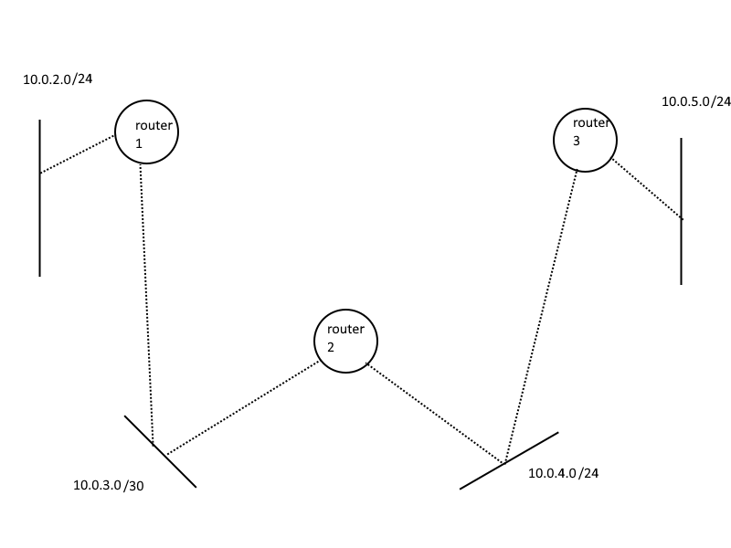

# Guía 3 — Internetworking / Ruteo

*Teoría de las Comunicaciones (RCCD) — FCEN, UBA*

## Ejercicio 1 — Circuitos virtuales

*(resuelto por Claude)*

Topología (red de circuitos virtuales):

```
        B            C            D
        |2           |2           |2
A --1[ S1 ]3---1[ S2 ]3---1[ S3 ]3-- E
```

Tablas de forwarding — cada fila es `(puerto_in, VCI_in) → (puerto_out, VCI_out)`:

| S1 IN | S1 OUT | | S2 IN | S2 OUT | | S3 IN | S3 OUT |
|---|---|---|---|---|---|---|---|
| (1,2) | (3,1) | | (1,1) | (3,3) | | (1,3) | (2,1) |
| (1,1) | (2,3) | | (1,2) | (3,2) | | (1,2) | (3,1) |
| (2,1) | (3,2) | | | | | | |

### ¿Cuántas conexiones hay?

Cada conexión es un camino que se arma encadenando las tablas: entrás por un `(puerto, VCI)`, salís por el `(puerto, VCI)` que dice la fila, y en el switch siguiente ese "out" es el "in" del próximo. Sigo cada fila hasta el final:

**Conexión 1 (A → D):**
- S1: `(1,2) → (3,1)` — entra de A (p1, VCI 2), sale a S2 (p3, VCI 1)
- S2: `(1,1) → (3,3)` — entra de S1 (p1, VCI 1), sale a S3 (p3, VCI 3)
- S3: `(1,3) → (2,1)` — entra de S2 (p1, VCI 3), sale a **D** (p2, VCI 1)

**Conexión 2 (A → B):**
- S1: `(1,1) → (2,3)` — entra de A (p1, VCI 1), sale a **B** (p2, VCI 3). *(Se queda en S1, no sigue.)*

**Conexión 3 (B → E):**
- S1: `(2,1) → (3,2)` — entra de B (p2, VCI 1), sale a S2 (p3, VCI 2)
- S2: `(1,2) → (3,2)` — entra de S1 (p1, VCI 2), sale a S3 (p3, VCI 2)
- S3: `(1,2) → (3,1)` — entra de S2 (p1, VCI 2), sale a **E** (p3, VCI 1)

Usé las 3 filas de S1, las 2 de S2 y las 2 de S3 → todas las entradas quedan cubiertas.

> **Hay 3 conexiones: A→D, A→B y B→E.**
> (Son unidireccionales: no hay filas para el sentido inverso, así que las cuento como 3 flujos.)

### a) ¿Qué información es necesaria (headers + tablas de forwarding)?

| | Circuitos virtuales | Datagramas |
|---|---|---|
| **Header del paquete** | sólo un **VCI** corto (el puerto de entrada es implícito) | la **dirección completa** de origen y **destino** |
| **Tabla de forwarding** | `(puerto_in, VCI_in) → (puerto_out, VCI_out)` | `red destino → próximo salto / interfaz` |
| **Setup previo** | sí, hay una **fase de establecimiento** del circuito antes de mandar datos | no, cada paquete se manda "cuando quiera" |

La diferencia de fondo: en CV el estado de la conexión vive **en los switches** (una fila por conexión) y el paquete lleva sólo un identificador chiquito (el VCI). En datagramas no hay estado por conexión: cada paquete es **autocontenido**, por eso tiene que cargar la dirección destino completa (más overhead por paquete).

### b) ¿Qué pasa con los flujos ante la caída de un nodo o enlace?

- **Circuitos virtuales:** si se cae un elemento por el que **pasa** el circuito, el circuito **se corta** y hay que **establecer uno nuevo** de punta a punta. Todos los VCs que atravesaban ese nodo/enlace se caen. → overhead de recuperación **grande**.
  - Ej.: si se cae S2, se caen A→D y B→E (pasan por S2); A→B sobrevive porque va sólo por S1.
- **Datagramas:** como cada paquete se rutea **independiente**, ante una caída sólo se pierden los paquetes que estaban **en tránsito** por ese elemento en ese instante. El ruteo (si es dinámico) reencamina por otro lado sin rearmar nada. → efecto de la falla **mínimo** (sólo esos paquetes en vuelo).


## Ejercicio 2

### a) ¿Cuál es el problema de poner el número de versión en otro lugar que no sea el principio del header?
Probablemente el hecho de que dependiendo de la versión de IP, el header cambia, así que idealmente se debe leer primero la versión de IP para entender correctamente el header.

### b) ¿Que campos del header IP pueden ser modificados por un router? ¿Cuáles deberían ser modificados?

ttl, y el checksum del header. calculo que puede cambiar flags y giladas cuando fragmenta, y las options.

### c) ¿Cuál es el tamaño máximo del paquete IP? ¿Qué campo del header define este tamaño? ¿Se utilizan normalmente paquetes de tamaño máximo? ¿Porqué?

eee total lenght es 16 bits entonces 65535 bytes? o sea es re al pedo igual pq honestamente si ethernet que suele ser lo más usado en capa 2 tiene un mtu de 1500 bytes para que vas a usar tantos bytes si igual lo vamos a fragmentar

## Ejercicio 3
Resuelto en clase

## Ejercicio 4

### a)
hay del /22 al /25, entonces 255.255.252.0, 254.0, 255.0, y 255.128

### b)
no voy a hacer la cuentita honestamente, la cantidad maxima de hosts es: si la red es /x, entonces cantidad max de hosts es
2^(32-x) - 2 (broadcast y red). para sacar la dirección de broadcast mandas al máximo, para la red al 0. el primer host es .1. 

Aplicando tu fórmula a cada red (host bits = 32 − x; red = bits de host en 0; broadcast = bits de host en 1):

**Router A**

| Red anunciada | Dirección de red | Hosts máx. (2^(32−x) − 2) | Broadcast |
|---|---|---|---|
| 135.46.56.0/22 | 135.46.56.0 | 1022 | 135.46.59.255 |
| 135.46.60.0/22 | 135.46.60.0 | 1022 | 135.46.63.255 |
| 192.53.40.0/23 | 192.53.40.0 | 510 | 192.53.41.255 |
| 192.53.40.0/24 | 192.53.40.0 | 254 | 192.53.40.255 |
| Default (0.0.0.0/0) | — | — | ruta comodín, no aplica |

**Router B**

| Red anunciada | Dirección de red | Hosts máx. | Broadcast |
|---|---|---|---|
| 135.46.56.0/25 | 135.46.56.0 | 126 | 135.46.56.127 |
| 135.46.60.0/25 | 135.46.60.0 | 126 | 135.46.60.127 |
| 192.53.40.0/23 | 192.53.40.0 | 510 | 192.53.41.255 |

Ejemplo de la "cuentita" para el caso feo, **135.46.56.0/22** (así ves de dónde sale el broadcast): /22 → la máscara corta el 3er octeto con 6 bits de red y 2 de host. El 3er octeto `56 = 00111000`; poniendo los 2 bits de host en 1 → `00111011 = 59`, y el 4to octeto todo en 1 → `255`. Entonces broadcast = **135.46.59.255**, y el rango de hosts va de 135.46.56.1 a 135.46.59.254 (1022 hosts).

### c)

Se resuelve con **longest prefix match**: de todas las entradas cuya red contiene a la IP, gana la de máscara **más específica**. Si no matchea ninguna → `Default` (si existe) o **descarte**.

Dos hechos estructurales que definen casi todo:
- **Router A tiene `Default`** → **nunca descarta**; lo que no matchea se va por el default (`135.46.62.100`).
- **Router B NO tiene `Default`** → **descarta** todo lo que no caiga en sus 3 redes.

| Destino | Router A | Router B |
|---|---|---|
| 135.46.57.14 | `56.0/22` → Interface1 | **descarta** (57 ∉ `56.0/25`, que sólo cubre .56.0–.56.127) |
| 135.46.63.10 | `60.0/22` → Interface0 | **descarta** (63 ∉ `60.0/25`) |
| 135.46.52.2 | ninguna específica → **Default → 135.46.62.100** | **descarta** |
| 208.70.188.15 | ninguna específica → **Default → 135.46.62.100** | **descarta** |
| 135.46.62.62 | `60.0/22` → Interface0 | **descarta** |
| 192.53.40.7 | matchea `/23` **y** `/24` → gana **`/24`** (más específica) → **135.46.60.100** | `192.53.40.0/23` → Interface1 |
| 135.46.56.7 | `56.0/22` → Interface1 | `56.0/25` (.7 ∈ .0–.127) → Interface0 |

**Aclaraciones clave:**
- **Descartar ≠ broadcast.** Un router IP sin ruta ni default **tira el paquete** (y suele devolver un ICMP *destination unreachable*). El flooding/broadcast ante destino desconocido es de switches en capa 2, no de routers en capa 3.
- **La tabla ARP no interviene acá.** El orden es: **primero ruteo (¿por dónde?), después ARP (¿con qué MAC?)**. Si el ruteo falla, nunca se llega a ARP; que la IP esté en la tabla ARP no le da una ruta a B.
- **`192.53.40.7` (el overlap):** cae en `/23` y en `/24` a la vez; gana la `/24` por ser más específica → next hop `135.46.60.100`. Como el next hop es una **IP** (no una interfaz), A la vuelve a buscar en su tabla: `135.46.60.100 ∈ 135.46.60.0/22` → sale físicamente por **Interface0**.

## Ejercicio 5

Bueno entonces aca deberíamos armar no se una tabla? idfk
tenemos que ponerle direcciones a todos los dispositivos asi que arrancamos desde la izquierda
estan en 172.16.5.0/24, entonces tienen 2^8-2 libres, es solo el ultimo octeto (conveniente), .0 es la red, .255 es el broadcast,
Entonces ponele que el router en if 0/1 tiene 172.16.5.1, y las pcs tiene .2 y .3 (i guess)
El router r1 tambien esta conectado abajo a 10.4.2.0/27, entonces hay 2^5-2 libres, son 30, entiendo que .0 es red, .31 es broadcast (el bloque del /27 va de .0 a .31; .32 ya es la red del siguiente bloque), ponele que r1. tiene 10.4.2.1 en if 0/0, r2 tiene 10.4.2.2 en if 0/0, y las pcs tiene .3 y .4.
Tercera red 168.192.2.0 es igual que el primero va de 0 a 255 en ultimo octeto, r2 en if 0/1 va a tener 168.192.2.1, las pcs tienen .2 y .3

### Solución completa

*(prolija, con tablas — hecho con Claude)*

**Topología:** tres redes unidas por dos routers.

- **Red A (izq):** `172.16.5.0/24` — PC1, PC2, R1 (if0/1)
- **Red central:** `10.4.2.0/27` — R1 (if0/0), R2 (if0/0), PC5, PC6
- **Red B (der):** `168.192.2.0/24` — PC3, PC4, R2 (if0/1)

Rangos: `/24` → hosts `.1`–`.254`, broadcast `.255`. `/27` → máscara `255.255.255.224`, bloque de 32, la subred `10.4.2.0/27` va de `.0` a `.31` → red `.0`, hosts `.1`–`.30`, **broadcast `.31`** (el `.32` ya es la red del siguiente `/27`).

#### Direcciones asignadas (dirección/máscara)

| Dispositivo | Interfaz | Dirección/máscara | Gateway |
|---|---|---|---|
| **R1** | if0/1 | `172.16.5.1/24` | — |
| **R1** | if0/0 | `10.4.2.1/27` | — |
| **R2** | if0/0 | `10.4.2.2/27` | — |
| **R2** | if0/1 | `168.192.2.1/24` | — |
| PC1 | eth | `172.16.5.2/24` | `172.16.5.1` |
| PC2 | eth | `172.16.5.3/24` | `172.16.5.1` |
| PC5 | eth | `10.4.2.3/27` | (rutas explícitas, ver abajo) |
| PC6 | eth | `10.4.2.4/27` | (rutas explícitas, ver abajo) |
| PC3 | eth | `168.192.2.2/24` | `168.192.2.1` |
| PC4 | eth | `168.192.2.3/24` | `168.192.2.1` |

#### Tablas de forwarding

**R1** — tiene dos redes directas (A por if0/1, central por if0/0); para llegar a la red B pasa por R2:

| Red destino | Próximo salto | Interfaz |
|---|---|---|
| `172.16.5.0/24` | conectada (directa) | if0/1 |
| `10.4.2.0/27` | conectada (directa) | if0/0 |
| `168.192.2.0/24` | `10.4.2.2` (R2) | if0/0 |

**R2** — espejo de R1:

| Red destino | Próximo salto | Interfaz |
|---|---|---|
| `168.192.2.0/24` | conectada (directa) | if0/1 |
| `10.4.2.0/27` | conectada (directa) | if0/0 |
| `172.16.5.0/24` | `10.4.2.1` (R1) | if0/0 |

**PC1 / PC2** (análogo PC3 / PC4 con su propio gateway) — red directa + default a su router:

| Red destino | Próximo salto | Interfaz |
|---|---|---|
| `172.16.5.0/24` | conectada (directa) | eth |
| `0.0.0.0/0` (default) | `172.16.5.1` (R1) | eth |

**PC5 / PC6** (están en la red central, con los dos routers) — rutas explícitas para ir a cada red por el router correcto:

| Red destino | Próximo salto | Interfaz |
|---|---|---|
| `10.4.2.0/27` | conectada (directa) | eth |
| `172.16.5.0/24` | `10.4.2.1` (R1) | eth |
| `168.192.2.0/24` | `10.4.2.2` (R2) | eth |

## Ejercicio 6

Bueno, de buenas a primeras, la red del browser tiene mascara /25, y las tablas de forwarding tienen asignado a /26. esto no sería un problema si esl browser tuviese ip 192.168.2.3 (por más que sea erroneo), porque encajaria, pero .90 no entra en el rango de una /26, que va hasta .63. Entonces, el ping se pierde en un loop entre R1 y R2 hasta que se queda sin TTL, ASUMIENDO que el browser tiene como default a R2. si no tiene como default a r2, se pierde antes de llegar al router.

no encuentro otros errores a ojimetro. se puede debatir que el hecho de que r1 y r2 se tengan como defaults es un error, porque causaría que paquetes que tienen que ser descartados reboten entre ambos routers hasta quedarse sin ttl y ser eventualmente expirados.

### Solución completa

*(prolija — hecho con Claude)*

**Configuración de la figura:**

| Dispositivo | Interfaz / dato | Valor |
|---|---|---|
| Server WWW | IP / máscara / GW | `172.16.5.88` / `255.255.255.0` (/24) / `172.16.5.98` |
| R1 | IF0/1 | `172.16.5.98` `255.255.255.0` (/24) |
| R1 | IF0/0 | `10.4.2.1` `255.255.255.224` (/27) |
| R1 | tabla | `172.16.5.0/24`→IF0/1 · `10.4.2.0/27`→IF0/0 · `192.168.2.0/26`→`10.4.2.25` · Default→`10.4.2.25` |
| R2 | IF0/1 | `192.168.2.62` `255.255.255.192` (/26) |
| R2 | IF0/0 | `10.4.2.25` `255.255.255.224` (/27) |
| R2 | tabla | `172.16.5.0/24`→`10.4.2.1` · `10.4.2.0/27`→IF0/0 · `192.168.2.0/26`→IF0/1 · Default→`10.4.2.1` |
| PC Web browser | IP / máscara / GW | `192.168.2.90` / `255.255.255.128` (/25) / `192.168.2.62` |

La red de la derecha está etiquetada `192.168.2.0/25` y el browser usa /25 → **la red es /25**; los `/26` son los errores.

#### a) ¿Dónde se pierde el paquete?

Hay que separar ida y vuelta. **El request llega bien; se pierde la respuesta (echo reply).**

**Ida — echo request `192.168.2.90 → 172.16.5.88`:**
1. Browser: `172.16.5.88` no es local (su /25 es `.0–.127`) → lo manda al gateway `192.168.2.62` (R2). `.62 ∈` su /25 → OK.
2. R2: matchea `172.16.5.0/24` → next hop `10.4.2.1` (R1), sale por IF0/0.
3. R1: matchea `172.16.5.0/24` → IF0/1 → **entrega al server**. ✅ La ida funciona completa.

**Vuelta — echo reply `→ 192.168.2.90`:**
1. Server: `.90` no es local → gateway `172.16.5.98` (R1).
2. R1 busca `.90`: `192.168.2.0/26` cubre `.0–.63` → **no matchea** `.90` → cae en **Default → `10.4.2.25`** (R2).
3. R2 busca `.90`: `192.168.2.0/26` tampoco matchea → **Default → `10.4.2.1`** (R1).
4. Vuelve a R1 → **loop R1↔R2** hasta que **TTL llega a 0** y se descarta.

➡️ **El paquete que se pierde es el echo reply, en el loop entre R1 y R2 (por agotamiento de TTL).** El browser nunca recibe respuesta.

#### b) Errores

**Error de máscara `/26` en vez de `/25` (aparece en 3 lugares):** la red real es `192.168.2.0/25` (`.0–.127`), pero se configuró `/26` (`.0–.63`), que no contiene a `.90`.

| # | Dónde | Está | Debería |
|---|---|---|---|
| 1 | Tabla de R1 | `192.168.2.0/26 → 10.4.2.25` | `192.168.2.0/25 → 10.4.2.25` |
| 2 | Tabla de R2 | `192.168.2.0/26 → IF0/1` | `192.168.2.0/25 → IF0/1` |
| 3 | Máscara de IF0/1 de R2 | `255.255.255.192` (/26) | `255.255.255.128` (/25) |

El **#3** es imprescindible además de las tablas: con la interfaz en /26, R2 no considera a `.90` como directamente conectada (`.90 ∉ .0–.63`), así que no le haría ARP ni le entregaría el paquete aunque la ruta matcheara.

**Agravante — default mutuo (R1→R2 y R2→R1):** no causa por sí solo la falla, pero es lo que convierte el error de máscara en un **loop** en vez de un descarte limpio:
- **Con** default mutuo → el reply rebota R1↔R2 hasta TTL=0.
- **Sin** default (o con uno sano) → el reply se descarta en R1 con ICMP *destination unreachable* (el ping igual falla, pero sin loop).

**Fix:** cambiar los tres `/26` a `/25` (`255.255.255.128`). Con eso: R1 matchea `192.168.2.0/25 → 10.4.2.25` (R2), R2 matchea `192.168.2.0/25 → IF0/1` y entrega a `.90` (ahora sí `∈` su subred). El default mutuo queda solo para destinos realmente desconocidos.

## Ejercicio 7

**Red (enlaces etiquetados con su costo):**

```
      3
  A ------- C ------- F
  |        /|    6
 8|      1/ |
  |      /  |
  |    E    |          enlaces: A-C=3, A-D=8, C-E=1,
  |   /|\   |                   C-F=6, B-E=2, D-E=2
  |  / | \  |
  | 2  |  2 |
  B    |    (C-E=1)
       |
  D ---+
    2
```

Adyacencias: **A**: C(3), D(8) · **B**: E(2) · **C**: A(3), E(1), F(6) · **D**: A(8), E(2) · **E**: B(2), C(1), D(2) · **F**: C(6).

### a) Tabla de forwarding de cada nodo

Cada tabla usa el camino de **menor costo** al destino (Dijkstra). Solo guardo el **próximo salto** (lo que va en la tabla real); anoto el costo total al lado para justificar.

**A** — todo sale por C. Ojo con **D**: el directo `A-D` cuesta 8, pero `A→C→E→D` = 3+1+2 = **6**, así que gana el camino por C.

| Destino | Próximo salto | Costo |
|---|---|---|
| B | C | 6 (A→C→E→B) |
| C | C | 3 |
| D | C | 6 (A→C→E→D) |
| E | C | 4 (A→C→E) |
| F | C | 9 (A→C→F) |

**B** — solo tiene el enlace a E, así que todo sale por E.

| Destino | Próximo salto | Costo |
|---|---|---|
| A | E | 6 (B→E→C→A) |
| C | E | 3 (B→E→C) |
| D | E | 4 (B→E→D) |
| E | E | 2 |
| F | E | 9 (B→E→C→F) |

**C**

| Destino | Próximo salto | Costo |
|---|---|---|
| A | A | 3 |
| B | E | 3 (C→E→B) |
| D | E | 3 (C→E→D) |
| E | E | 1 |
| F | F | 6 |

**D** — igual que A, a `A` conviene ir por E (`D→E→C→A` = 6) antes que por el enlace directo `D-A` = 8.

| Destino | Próximo salto | Costo |
|---|---|---|
| A | E | 6 (D→E→C→A) |
| B | E | 4 (D→E→B) |
| C | E | 3 (D→E→C) |
| E | E | 2 |
| F | E | 9 (D→E→C→F) |

**E** — es el nodo central; llega a casi todo directo por sus vecinos.

| Destino | Próximo salto | Costo |
|---|---|---|
| A | C | 4 (E→C→A) |
| B | B | 2 |
| C | C | 1 |
| D | D | 2 |
| F | C | 7 (E→C→F) |

**F** — solo tiene el enlace a C, todo sale por C.

| Destino | Próximo salto | Costo |
|---|---|---|
| A | C | 9 (F→C→A) |
| B | C | 9 (F→C→E→B) |
| C | C | 6 |
| D | C | 9 (F→C→E→D) |
| E | C | 7 (F→C→E) |

### b) ¿De qué maneras se pueden llenar esas tablas?

Dos formas:

- **Ruteo estático:** el admin carga las rutas **a mano**. Ventaja: control total y cero overhead de protocolo (no consume red ni CPU). Desventaja: no se adapta solo — si se cae un enlace o cambia un costo, hay que reconfigurar manualmente, y en redes grandes es inmanejable y propenso a errores.

- **Ruteo dinámico:** los routers descubren y arman las tablas solos corriendo un protocolo. Se adaptan automáticamente a caídas y cambios de topología (convergen). El costo es el overhead: mensajes periódicos entre routers + CPU/memoria para correr el algoritmo. Dos familias:
  - **Distance Vector** (ej. RIP): cada nodo le pasa a sus vecinos su vector de distancias (destino, costo). Simple, poca memoria, pero converge lento y sufre problemas como *count-to-infinity*.
  - **Link State** (ej. OSPF): cada nodo inunda (*flooding*) el estado de sus enlaces a **toda** la red; cada uno arma el mapa completo y corre Dijkstra localmente. Converge más rápido y escala mejor, a costa de más memoria y CPU por nodo.


## Ejercicio 8

Off the top of my head, RIP funcionaba sin costos relativos, solo con jumps, Y se mandaba solo a vecnos directos (creo?)

### a)
en este caso, A tendría en 0 a si mismo, en 1 a sus vecinos directos b c e y f, y en inf a los demas
en la matriz global habrían 1's por cada vecino directo cruzado, 0 en la diagonal, e infinito en el resto. vease

A tiene 1 en b c e f, 0 en si mismom
B tiene 1 en C A, 0 en si mismo
C tiene 1 en A B D, 0 en si mismo
D tiene 1 en C y G, 0 en si mismo
F tinee 1 en A y G, 0 en si mismo
E tiene 1 en A, 0 en si mismo.

### b)
Esto sería entonces UN paso más adelante. A le manda a sus vecinos su tablita. Ahora, por ejemplo, E sabe que B, C y F pasan a estar a 2 de distancia en vez de infinito. B pasa a saber que F esta a 2, lo mismo con E. C pasa a saber que E y F están a 2.
A recibe de C que D está ahí al lado, y F que G también. No voy a escribir la tablas, están en ClaseRuteoRIP.pdf, claude las puede bajar. 
El mensaje de A diría que tiene:
A 0
B 1
C 1
E 1
F 1
G 2
D 2
Todavía no convergió porque a E le faltan un par de datos creo. G creo que ya tiene todo por F que recibió datos de A antes.
Converge en la prox, y eso es el c). lo hace claude.

### Solución completa

*(prolija, con matrices — hecho con Claude)*

**Red del ejercicio** (RIP → todos los enlaces valen 1 salto):

```
         B
        / \
       /   \
      A─────C
     /|      \
    F E       D
     \        /
      \      /
       G────/
```

Enlaces: `A-B`, `A-C`, `A-E`, `A-F`, `B-C`, `C-D`, `D-G`, `F-G`.
Adyacencias: **A**: B,C,E,F · **B**: A,C · **C**: A,B,D · **D**: C,G · **E**: A · **F**: A,G · **G**: D,F.

Recordatorio RIP: métrica = **saltos** (no costos), cada nodo manda su **vector de distancias completo** solo a sus **vecinos directos**, periódicamente. Regla de update (Bellman-Ford): `D(x) = min sobre vecinos v de [ 1 + D_v(x) ]`.

> Tu parte a) está bien (la adyacencia es correcta); solo faltaba la fila de **G** y hay un typo suelto. Abajo va la matriz completa de cada escenario y el mensaje que manda A.

#### a) Recién bootean (solo vecinos directos)

Cada nodo sabe `0` a sí mismo, `1` a sus vecinos, `∞` al resto.

**Mensaje de A:** `A:0, B:1, C:1, E:1, F:1` (D y G = ∞, todavía no los conoce).

**Matriz global** (fila = qué cree cada nodo; `.` = ∞):

| desde\hacia | A | B | C | D | E | F | G |
|---|---|---|---|---|---|---|---|
| **A** | 0 | 1 | 1 | . | 1 | 1 | . |
| **B** | 1 | 0 | 1 | . | . | . | . |
| **C** | 1 | 1 | 0 | 1 | . | . | . |
| **D** | . | . | 1 | 0 | . | . | 1 |
| **E** | 1 | . | . | . | 0 | . | . |
| **F** | 1 | . | . | . | . | 0 | 1 |
| **G** | . | . | . | 1 | . | 1 | 0 |

#### b) Ya propagaron una vez (conocen hasta 2 saltos)

Cada nodo aplicó la regla sobre los vectores que recibió de sus vecinos.

**Mensaje de A:** `A:0, B:1, C:1, D:2, E:1, F:1, G:2`
- D lo aprende por C (`1 + C→D(1) = 2`); G lo aprende por F (`1 + F→G(1) = 2`).

**Matriz global:**

| desde\hacia | A | B | C | D | E | F | G |
|---|---|---|---|---|---|---|---|
| **A** | 0 | 1 | 1 | 2 | 1 | 1 | 2 |
| **B** | 1 | 0 | 1 | 2 | 2 | 2 | . |
| **C** | 1 | 1 | 0 | 1 | 2 | 2 | 2 |
| **D** | 2 | 2 | 1 | 0 | . | 2 | 1 |
| **E** | 1 | 2 | 2 | . | 0 | 2 | . |
| **F** | 1 | 2 | 2 | 2 | 2 | 0 | 1 |
| **G** | 2 | . | 2 | 1 | . | 1 | 0 |

Los `∞` que quedan son exactamente los pares a **3 saltos**: B↔G, D↔E, E↔G. (Ojo: **G todavía no está completo** — le faltan B y E; en tu nota decías que G ya tenía todo, pero no.)

#### c) Ya convergió (conocen hasta 3 saltos = diámetro de la red)

Una ronda más y se llenan los `∞` restantes con 3. Como el diámetro es 3, acá ya no cambia nada más.

**Mensaje de A:** `A:0, B:1, C:1, D:2, E:1, F:1, G:2` — **idéntico al de b)**: A ya había convergido en la ronda anterior, así que su mensaje no cambia.

**Matriz global (final):**

| desde\hacia | A | B | C | D | E | F | G |
|---|---|---|---|---|---|---|---|
| **A** | 0 | 1 | 1 | 2 | 1 | 1 | 2 |
| **B** | 1 | 0 | 1 | 2 | 2 | 2 | **3** |
| **C** | 1 | 1 | 0 | 1 | 2 | 2 | 2 |
| **D** | 2 | 2 | 1 | 0 | **3** | 2 | 1 |
| **E** | 1 | 2 | 2 | **3** | 0 | 2 | **3** |
| **F** | 1 | 2 | 2 | 2 | 2 | 0 | 1 |
| **G** | 2 | **3** | 2 | 1 | **3** | 1 | 0 |

En negrita las entradas que pasaron de `∞` a `3` en esta última ronda.


## Ejercicio 9

### a)
Link State manda la información de sus vecinos hacia todos los nodos
Distance Vector manda la matriz general de todos los nodos a sus vecinos directos.

### b)
En Link State cada router mantiene una LSDB, información de todos los nodos identica. De ahí viene el concepto de Link State, es un estado enlazado que tienen todos los routers. RIP por otro lado solo retiene vía rumores los valores que necesita para saber a que vecino mandarle un paquete cuando tiene que. 

### c)
En LS entre todos los routers, en RIP solo con sus vecinos exclusivamente conectados. RIP manda toda la tabla todas las veces, OSPF manda actualizaciones de los cambios nuevos via LSA. RIP manda cada 30 segundos (normalmente), LS manda on event, tipo webhook

### d)
LS es bastante más cpu heavy, especialmente en ospf, porque en cada update (que puede ocurrir mas frecuentemente que 30 segundos) tiene que correr un weighted djisktra de shortest path first, mientras que RIP corre un bellman ford sin pesos que es mucho más simple computacionalmente, porque solo cuenta aristas no tiene en cuenta pesos.

### e)
Principalmente por el problema del conteo infinito, OSPF escala mucho mejor, ya que RIP está limitado a 16 dispositivos. Además, es bastante más realista para redes grandes. No tener en cuenta pesos es naive, en redes que son medianamente grandes. 

### Revisión / correcciones

*(hecho con Claude)*

Las respuestas de arriba van bien encaminadas. Tres cosas a corregir para que queden finas:

- **a) Distance Vector manda su *propio* vector, no "la matriz general".** Cada nodo envía solo su fila `{destino: costo}` a sus **vecinos directos**. La matriz global del Ej. 8 es una vista para nosotros; ningún nodo la tiene entera ni la manda. (Link State es el espejo: info *local* — solo sus enlaces — pero a *todos* por flooding.)
- **d) DV no es más barato "por no tener pesos".** Bellman-Ford maneja pesos sin problema (EIGRP es DV con pesos); que RIP use saltos es una elección de **métrica**. Lo barato de DV es que el update es un **`min` local** sobre los vectores recibidos; lo caro de LS es correr **Dijkstra sobre la topología completa** en cada cambio.
- **e) RIP se limita a 15 saltos, no a "16 dispositivos".** El `16` es el valor que RIP usa como **∞** (para cortar el count-to-infinity); el diámetro máximo de la red es **15 saltos** (puede haber muchos más de 16 nodos).

#### Tabla comparativa

| Aspecto | Link State (OSPF) | Distance Vector (RIP) |
|---|---|---|
| **a) Qué manda cada mensaje** | Solo el estado de **sus propios enlaces** (vecinos + costo), con nº de secuencia (LSP/LSA) | Su **vector de distancias** completo `{destino: costo}` |
| **A quién / c) intercambio** | A **toda la red** por *flooding* confiable | Solo a **vecinos directos** |
| **Cuándo** | *On-event* (al cambiar la topología) + refresh periódico | Periódico, **cada 30 s** (+ triggered updates) |
| **b) Conocimiento / memoria** | **Topología completa** (LSDB idéntica en todos) → ~`O(E)` | Solo **su propio vector** (destino, costo, próximo salto) → ~`O(N)` |
| **d) CPU por update** | **Dijkstra** sobre todo el grafo → ~`O(E·log N)` | **`min`** sobre vectores de vecinos (Bellman-Ford) → barato |
| **Convergencia** | Rápida; sin count-to-infinity | Lenta; sufre **count-to-infinity** (parches: split horizon, poison reverse, ∞=16) |
| **Métrica típica** | Costo (p. ej. `10⁸/ancho de banda`) | **Saltos** (máx. 15) |
| **e) Escalabilidad** | **Escala mejor**: converge rápido y soporta **jerarquía (áreas OSPF)** | Solo redes chicas (≤15 saltos, updates pesados, convergencia lenta) |

**Conclusión (e):** para redes grandes escala mejor **Link State / OSPF**: converge más rápido, no tiene count-to-infinity, la métrica por costo es más realista que contar saltos, y la división en **áreas** acota el flooding y el tamaño de la LSDB. El precio es más memoria y CPU por nodo.

---

**Dónde encontrar esto (para no depender de Google):** es contenido de teórica pura, no sale de una práctica puntual — por eso te costó ubicarlo.
- La fuente canónica es **Tanenbaum & Wetherall, *Computer Networks* (5ª ed.), Cap. 5.2**: **5.2.4 Distance Vector Routing** y **5.2.5 Link State Routing**. Toda esta comparación (mensajes, memoria, CPU, count-to-infinity, escalabilidad) sale literal de ahí. Es justo la bibliografía que la propia guía cita al final.
- Del lado de la cursada: **Teórica 10 (ruteo)** para la comparación LS vs DV, y la clase/práctica de **RIP** (`ClaseRuteoRIP.pdf`) para el lado Distance Vector. El lado Link State/OSPF está menos cubierto en las prácticas (aparece recién en los Ej. 12, 13, 17), así que para el detalle fino de OSPF conviene ir directo a Tanenbaum.

## Ejercicio 10

La respuesta realmente es depende. Vamos caso a caso
- Forwarding IP con Ruteo Estático: Este puede llegar a encontrar el camino más corto si el admin está atento y la tabla está al día con la realidad.
- Forwarding IP con OSPF: Este puede llegar a encontrar el camino más corto si el grafo ya convergió y no hay LSA's por procesar.
- Forwarding IP con RIP: Este es menos propenso a encontrar el verdadero camino más corto. Solo es el caso si el camino más corto de nodo A a nodo B coincide con ser el que menos saltos tiene, cosa que no tiene porque darse. Además también tiene que estar al día. RIP revisa cada 30 segundos así que hay un margen del tiempo en el que la tabla ni se enteró de que un link murió.
- Flooding: Flooding SIEMPRE encuentra el camino más corto, por estadistica. También encuentra absolutamente todo el resto de caminos, por eso es ampliamente ineficiente para ir de punto A a punto B, pero efectivamente encuentra el más corto, para todo t en cualquier instante.

## Ejercicio 11

Esto puede pasar porque el flooding no es perfecto y las cosas tardan en viajar. No se debe mirar la timestamp del recibimiento sino más el age y el sequence number del mensaje. Además, C debería asumir el link como caído porque al OSPF ser un Two way state, ambos deben marcar que están conectados.

## Ejercicio 12

Ok! OSPF Manda a todos vía flooding el dato de sus vecinos directos, entonces presumo que B, D Y C van a mandar varias cosas
Paso 1:
A recibe HELLO de sus vecinos B y C, y responde quien es, al igual que manda sus HELLO.
De ahí A recibe paquete de B, C y D que informan, con su sq y su age que

B: A esta a 5, D está a 2, C está a 2
C: A está a 2, D está a 1, B está a 2
D: B está a 2, C está a 1.

Con eso A ajusta y dice ok... C quedá igual, pero B me convieen más ir por C y hacer ACB antes que AB, entonces lo bajo a 4...
Después viene D, que me dice que está a 1 de C, y C lo tengo a 2, entonces AD es 3...
Y con eso queda.

### Solución completa

*(prolija — hecho con Claude)*

**Red (OSPF, enlaces con su costo):** A–B=5, A–C=2, B–C=2, B–D=2, C–D=1.

```
      5        2
   A ───── B ───── D
    \      │      /
   2 \    2│    /1
      \    │  /
       ╲   │ ╱
         C
   (A–C=2, B–C=2, C–D=1)
```

Idea clave de OSPF (**Link State**): el mensaje **no** lleva distancias calculadas (eso es Distance Vector), lleva el **estado de los propios enlaces** de cada router (topología). Cada router junta todos los LSAs, reconstruye el **mapa completo** y corre **Dijkstra localmente**.

#### a) Mensajes que recibe A hasta converger

**1. HELLO (descubrimiento de vecinos).** A solo tiene enlaces directos a **B** y **C**, así que intercambia HELLO con ellos y establece adyacencia. (A D no lo toca directo.)

**2. LSAs (Router-LSA) inundados por *flooding*.** Cada router genera un LSA que describe **sus propios enlaces**, con `Router-ID`, `nº de secuencia` y `age`. A recibe:

| Origen | Enlaces que anuncia (vecino : costo) |
|---|---|
| **B** | A:5, C:2, D:2 |
| **C** | A:2, B:2, D:1 |
| **D** | B:2, C:1 |

(El de D le llega a A por flooding a través de B/C, aunque no sean vecinos. A también genera y floodea su propio LSA: A→B:5, A→C:2. Los LSAs repetidos que lleguen por distintos caminos se descartan quedándose con el de mayor nº de secuencia.)

#### b) Cómo A construye su tabla (Dijkstra sobre el mapa completo)

Con todos los LSAs, A tiene el grafo entero y corre SPF desde sí mismo:

| Paso | Nodo fijado | Distancias tentativas |
|---|---|---|
| 0 | A (0) | B=5, C=2, D=∞ |
| 1 | **C (2)** | B=min(5, 2+2)=**4**, D=2+1=**3** |
| 2 | **D (3)** | B=min(4, 3+2)=4 (sin cambio) |
| 3 | **B (4)** | — |

**Tabla de ruteo de A:**

| Destino | Costo | Próximo salto | Camino |
|---|---|---|---|
| B | 4 | C | A→C→B |
| C | 2 | C | A→C |
| D | 3 | C | A→C→D |

Todo sale por **C**: el enlace directo A–B (5) pierde contra A→C→B (4), y a D se llega por A→C→D (3).

## Ejercicio 13

*(resuelto con Claude)*

Calcular la **capacidad de red (bps)** que consume el protocolo de ruteo (solo su overhead, aparte de los datos) en tres topologías, ya convergidas.

**Datos del enunciado:**
- Updates automáticos cada **30 s**.
- Overhead de headers = **32 bits** (para ambos protocolos).
- Métricas = entero de **32 bits**. Direcciones = **IPv4 = 32 bits**.
- OSPF: ignorar paquetes de control (HELLO, ACK); contar los updates automáticos.

**Idea general:** `bps = (bits que se mandan por ciclo) / 30 s`. Todo el trabajo es contar bits por ciclo, y para eso hace falta el **tamaño de cada mensaje** (con las piezas de arriba) y el **comportamiento** de cada protocolo (quién manda qué a quién).

### Modelo de cada protocolo

**RIP (Distance Vector):** cada router manda su **tabla completa** a **cada vecino directo**.
- Tamaño de un mensaje = `32 (header) + R × (32 dir + 32 métrica) = 32 + 64·R`, con `R` = nº de destinos. Acá `R = 5` (un destino por router; convención fija para las tres redes).
- → cada mensaje = `32 + 64×5 = 352 bits`.
- Nº de mensajes por ciclo = un mensaje por cada sentido de cada enlace = **`2 × (nº de enlaces)`** = suma de grados.

**OSPF (Link State):** cada router **floodea** un LSA que describe **sus propios enlaces**, y por flooding cada LSA cruza **todos** los enlaces (convención `O(n·E)`: una vez por enlace).
- Tamaño de un LSA = `32 (header) + grado × (32 + 32) = 32 + 64·grado`.
- Bits por ciclo = `(nº de enlaces) × Σ(tamaño de todos los LSAs)`, o equivalente: cada enlace transporta los `n` LSAs.

> Dato útil: en cualquier grafo `Σ grados = 2 × enlaces`. Por eso, con la misma cantidad de enlaces, RIP y OSPF dan lo mismo aunque cambie la forma (mientras sea árbol). La topología recién pesa cuando cambia el **nº de enlaces** (y aparecen ciclos).

### Red 1 — Línea (A–B–C–D–E), 4 enlaces

```
A — B — C — D — E
```
Grados: A=1, B=2, C=2, D=2, E=1.

**RIP:** mensajes = `2×4 = 8`, cada uno 352 bits.
`8 × 352 = 2816 bits/ciclo` → **2816 / 30 ≈ 93,9 bps**

**OSPF:** LSAs → A,E: `32+64=96`; B,C,D: `32+128=160`. `Σ = 672 bits`.
Es un árbol → cada LSA cruza los 4 enlaces: `672 × 4 = 2688 bits/ciclo` → **2688 / 30 ≈ 89,6 bps**

### Red 2 — Estrella (A central con B, C, D, E), 4 enlaces

```
    B
    |
C — A — D
    |
    E
```
Grados: A=4, B=C=D=E=1.

**RIP:** A manda 4, cada hoja manda 1 → `2×4 = 8` mensajes de 352.
`8 × 352 = 2816 bits/ciclo` → **≈ 93,9 bps** (igual que la línea).

**OSPF:** LSAs → A: `32+256=288`; B,C,D,E: `32+64=96`. `Σ = 288 + 4×96 = 672 bits`.
Árbol con 4 enlaces → `672 × 4 = 2688 bits/ciclo` → **≈ 89,6 bps** (igual que la línea).

*La línea y la estrella dan idéntico: mismo nº de enlaces y ambas son árboles.*

### Red 3 — Malla completa K5, 10 enlaces

```
todos con todos (5 nodos → 5×4/2 = 10 enlaces)
```
Grados: todos = 4.

**RIP:** mensajes = `2×10 = 20`, cada uno 352 bits.
`20 × 352 = 7040 bits/ciclo` → **7040 / 30 ≈ 234,7 bps**

**OSPF:** todos los LSAs = `32 + 4×64 = 288 bits`. `Σ = 5×288 = 1440 bits`.
Cada enlace transporta los 5 LSAs: `1440 × 10 = 14400 bits/ciclo` → **14400 / 30 = 480 bps**

> **Nota sobre ciclos:** el `× 10` usa la convención estándar "una vez por enlace" (`O(n·E)`). El flooding **real** en un grafo con ciclos genera **duplicados** (un LSP llega por dos lados antes de descartarse; en K5 son ~16 transmisiones por LSP en vez de 10), así que el conteo físico sería mayor. Si la cátedra pide contar duplicados, el número sube; con la convención habitual queda 14400.

> **Posible corrección (consultar en clase):** si se cuenta el flooding tal como se transmite físicamente —cada router reenvía la primera copia recibida por todas sus interfaces salvo la de entrada, y luego descarta los duplicados—, en `K5` cada LSA se transmite `4 + 4×3 = 16` veces, no 10. Como cada LSA mide 288 bits y hay 5 routers, el consumo OSPF de la red 3 sería `5×16×288 = 23040 bits/ciclo`, es decir **768 bps**. El valor de **480 bps** corresponde a la simplificación de contar cada LSA una única vez por enlace. Hay que confirmar qué convención espera la cátedra.

### Resultado y conclusión

| Red | Enlaces | RIP (bits/ciclo · bps) | OSPF (bits/ciclo · bps) |
|---|---|---|---|
| 1 (línea) | 4 | 2816 · 93,9 | 2688 · 89,6 |
| 2 (estrella) | 4 | 2816 · 93,9 | 2688 · 89,6 |
| 3 (malla K5) | 10 | 7040 · 234,7 | **14400 · 480** |

**Conclusión:** en redes poco conectadas (árboles) ambos protocolos consumen casi lo mismo. Pero en la **malla densa OSPF cuesta más del doble que RIP**: RIP crece como `2·enlaces × (tabla fija)`, mientras que OSPF crece como `enlaces × ΣLSA`, y en una malla el `ΣLSA` **también** crece con la conectividad → el flooding replica LSAs grandes sobre muchísimos enlaces. Es el precio de que *todos conozcan la topología completa*.

*(Recordar que estos números salen de la simplificación del enunciado — OSPF real no manda updates completos cada 30 s, sino que refresca LSAs cada ~30 min y usa updates disparados por evento. Acá se lo fuerza a 30 s solo para poder compararlo con RIP.)*

## Ejercicio 14

*(parte a resuelta con Claude — el b lo hago yo)*

Se dan tres tablas obtenidas de **distintos equipos** de una red TCP/IP y hay que deducir el esquema (redes, routers, switches, hosts con IP/máscara/MAC).

**Las tres tablas y de quién son:**
- **Tabla 1 (Red / Máscara / Próximo salto):** tabla de ruteo → de un **router (R1)**.
- **Tabla 2 (MAC Address / Ports):** tabla de direcciones MAC → de un **switch**.
- **Tabla 3 (Address / Age / Hardware Addr / Interface):** tabla **ARP** → del mismo **R1** (usa Fa0/0 y Fa0/1, igual que la tabla 1).

**Dato clave:** en la ARP, `Age = -` significa **dirección local**, o sea que esa fila es una **interfaz del propio R1**. De ahí salen IP + MAC de R1.

### Redes (3 concretas; la default no es una red)

| Red | Máscara | Notación | Cómo la conoce R1 |
|---|---|---|---|
| `192.168.13.0` | `255.255.255.0` | `/24` | directa, por Fa0/1 |
| `158.42.52.0` | `255.255.252.0` | `/22` | directa, por Fa0/0 |
| `168.254.0.0` | `255.255.0.0` | `/16` | remota, vía R2 (`158.42.55.243`) |
| `0.0.0.0/0` (default) | — | — | vía gateway `158.42.55.250` |

El `/22` cubre `158.42.52.0`–`158.42.55.255` (por eso `.55.243` y `.55.250` caen adentro).

### Interfaces de R1 (las filas ARP con `-` = local)

| Interfaz | IP | MAC | Red |
|---|---|---|---|
| **Fa0/0** | `158.42.52.253` | `000c.cfc7.d401` | `158.42.52.0/22` |
| **Fa0/1** | `192.168.13.1` | `000c.cfc7.d402` | `192.168.13.0/24` |

### El switch (tabla MAC/Ports) → topología física del `/22`

Cruzando cada MAC de la tabla 2 con la ARP de R1:

| Puerto switch | MAC | Equipo | IP |
|---|---|---|---|
| Fa0/1 | `000c.cfc7.d401` | **R1** (Fa0/0) | `158.42.52.253` |
| Fa0/2 | `00d0.ff9e.db01` | **R2** | `158.42.55.243` |
| Fa0/3 | `0004.9aa4.7b48` | **PC1** | `158.42.52.20` |
| Fa0/4 | `0004.9ad7.5882` | **PC2** | `158.42.53.125` |

- **R2** (`158.42.55.243`, MAC `00d0.ff9e.db01`) está en el `/22` y es el próximo salto hacia `168.254.0.0/16` → conecta la red 2 con la red 3.
- **Gateway default** `158.42.55.250`: está en el `/22` (por eso es alcanzable por Fa0/0), pero no aparece en ARP ni en el switch → sabemos que existe, no su MAC ni su puerto.

### Esquema deducido (a)

```
              red 192.168.13.0/24
                       │
      Fa0/1 192.168.13.1  (000c.cfc7.d402)
                 ┌───────┴───────┐
                 │      R1       │
                 └───────┬───────┘
      Fa0/0 158.42.52.253  (000c.cfc7.d401)
                       │
              ┌────────┴─────────┐
              │      SWITCH       │   red 158.42.52.0/22
              └─┬──────┬──────┬───┘
             Fa0/2  Fa0/3  Fa0/4       (Fa0/1 → R1)
               │      │      │
              R2     PC1    PC2
          .55.243  .52.20  .53.125
        00d0.ff9e 0004.9aa4 0004.9ad7
               │
        red 168.254.0.0/16

   (+ gateway default 158.42.55.250, en el /22, MAC/puerto desconocidos)
```

### b) A qué entrada va cada datagrama

R1 aplica **longest prefix match** sobre su tabla de ruteo.

| IP destino | Entrada de la tabla | Salida | Nota |
|---|---|---|---|
| `158.42.196.11` | `0.0.0.0/0` (default) | → `158.42.55.250` | `.196` ∉ `/22` (`.52`–`.55`) |
| `158.42.52.13` | `158.42.52.0/22` | Fa0/0 (directa) | — |
| `127.0.0.1` | — (loopback) | **no se rutea** | `127.0.0.0/8` es local; se maneja en el host, nunca sale por una interfaz (si llegara del cable, se descarta como *martian*) |
| `192.168.1.1` | `0.0.0.0/0` (default) | → `158.42.55.250` | no matchea `192.168.13.0/24` (`.1.x` ≠ `.13.x`). El ruteo **no** descarta por ser rango privado |
| `192.168.13.123` | `192.168.13.0/24` | Fa0/1 (directa) | — |
| `168.254.255.255` | `168.254.0.0/16` | → `158.42.55.243` (R2) | es la **broadcast dirigida** del `/16` |

**Dos trampas del ejercicio:**
- `127.0.0.1` es **loopback**: no se reenvía; se resuelve localmente (no confundir con la ruta default).
- `192.168.1.1` **no** se descarta por ser IP privada — el forwarding solo sigue la tabla (longest prefix match), así que cae en la default. Filtrar rangos privados es tarea de un firewall/política, no de la decisión de ruteo.


## Ejercicio 15

*(emprolijado con Claude)*

Datos: el router (R1) tiene dos interfaces, **10.0.2.1/24** y **10.0.3.1/30**. Tiene un único router vecino directamente conectado (R2), del que recibe periódicamente este paquete RIP:

| 10.0.2.0 | 10.0.3.0 | 10.0.4.0 | 10.0.5.0 |
|---|---|---|---|
| 255.255.255.0 | 255.255.255.252 | 255.255.255.0 | 255.255.255.0 |
| 1 | 0 | 0 | 1 |

Convención de la práctica: red directamente conectada → costo **0**; red aprendida → costo recibido **+1**.

### a) Topología posible

Lectura del paquete de R2:
- **10.0.3.0/30 con costo 0** → R2 está conectado a esa red. Es la que compartimos (el /30 punto a punto entre R1 y R2).
- **10.0.4.0/24 con costo 0** → también es una red directa de R2.
- **10.0.2.0/24 con costo 1** → está a un salto de R2: es la nuestra, la aprendió de nosotros. (Que nos la devuelva significa que R2 **no usa split horizon**.)
- **10.0.5.0/24 con costo 1** → está a un salto de R2 y no es nuestra → hay un **tercer router (R3)** más allá de R2, conectado a 10.0.4.0/24 y a 10.0.5.0/24.

```
10.0.2.0/24 — R1 — 10.0.3.0/30 — R2 — 10.0.4.0/24 — R3 — 10.0.5.0/24
        .2.1    .3.1          .3.2
```



### b) Paquete RIP que envía R1

R1 anuncia sus dos redes directas con costo 0 y las que aprendió de R2 con costo +1. Asumo **sin split horizon** (igual que R2):

| 10.0.2.0 | 10.0.3.0 | 10.0.4.0 | 10.0.5.0 |
|---|---|---|---|
| 255.255.255.0 | 255.255.255.252 | 255.255.255.0 | 255.255.255.0 |
| 0 | 0 | 1 | 2 |

*(Con split horizon, R1 no le devolvería a R2 lo que aprendió de él: el paquete llevaría sólo 10.0.2.0/24 y 10.0.3.0/30 con costo 0.)*

### c) Tabla de forwarding de R1

El next hop hacia las redes remotas es la IP de R2 en el /30. En un /30 las direcciones son .0 (red), .1, .2 y .3 (broadcast); la .1 es nuestra, así que R2 **tiene que ser 10.0.3.2** (el único host que queda).

| Red destino | Próximo salto |
|---|---|
| 10.0.2.0/24 | interfaz 10.0.2.1 (directa) |
| 10.0.3.0/30 | interfaz 10.0.3.1 (directa) |
| 10.0.4.0/24 | 10.0.3.2 |
| 10.0.5.0/24 | 10.0.3.2 |

*(El enunciado no numera las interfaces; si se las llama IF0 / IF1, es una asignación asumida.)*


## Ejercicio 16

### a)
R1 inunda **un solo LSP** con las redes a las que está directamente conectado, cada una con su costo $10^{10}/BW$ (formato de la cátedra `ID | NUM SEQ | TTL | RED | COSTO`; SEQ y TTL simbólicos):

```
ID: R1 | SEQ: Y | TTL: X
```

| Red | BW | Costo |
|---|---|---|
| 161.139.1.224/27 | 100 Mbps | 100 |
| 161.139.1.192/27 | 100 Mbps | 100 |
| 161.139.0.0/29 | 10 Gbps | 1 |
| 161.139.0.24/29 | 1 Gbps | 10 |

Los routers vecinos no van como fila aparte: quedan implícitos en las redes compartidas (0.0/29 y 0.24/29), que ellos también anuncian en sus LSPs.

### b)
Asumo que la consigna quiso decir 161.139.0.24/29 (red por la que se conecta R1 con mi hipotetico R3)
Supongo que el RIP si ya convergió, pre corte sería tipo

| Red | Saltos |
|---|---|
| 161.139.1.224/27 |  0   |
| 161.139.1.192/27 |  0   |
| 161.139.0.0/29   |  0   |
| 161.139.0.24/29  |  0   |
| 161.139.1.128/26 |  1   | 
| 161.139.0.8/29   |  1   | 
| 161.139.0.16/29  |  1   | 
| 161.139.1.0/26   |  1   | 
| 161.139.1.64/26  |  2   |

Post corte, sería algo así

| Red | Saltos |
|---|---|
| 161.139.1.224/27 |  0   |
| 161.139.1.192/27 |  0   |
| 161.139.0.0/29   |  0   |
| 161.139.0.24/29  |  16  |
| 161.139.1.128/26 |  1   | 
| 161.139.0.8/29   |  1   | 
| 161.139.0.16/29  |  2   | 
| 161.139.1.0/26   |  3   | 
| 161.139.1.64/26  |  2   |

## Ejercicio 17

### a)
```
ID: R1 | SEQ: Y | TTL: X
```

| Red | BW | Costo |
|---|---|---|
| 192.168.5.0/30 | 1gbps | 10 |
| 192.168.1.0/30 | 10mbps | 1000 |
| 161.139.21.64/26 | 1gbps | 10 |

### b)

*(armado con Claude)*

**Topología y costos** ($10^{10}/BW$). Llamo **RA** (arriba), **RI** (izquierda), **RD** (derecha) a los otros tres routers.
| Red | Entre | BW | Costo |
|---|---|---|---|
| 161.139.21.64/26 | R1 (hosts) | 1 Gbps | 10 |
| 161.139.21.128/26 | RI (hosts) | 1 Gbps | 10 |
| 161.139.21.0/26 | RA (hosts) | 1 Gbps | 10 |
| 161.139.21.192/26 | RD (hosts) | 1 Gbps | 10 |
| 192.168.5.0/30 | R1–RI | 1 Gbps | 10 |
| 192.168.1.0/30 | R1–RD | 10 Mbps | 1000 |
| 192.168.4.0/30 | RI–RA | 100 Mbps | 100 |
| 192.168.3.0/30 | RA–RD | 1 Gbps | 10 |
| 192.168.2.0/30 | RI–RD | 10 Mbps | 1000 |

**Direcciones** (sólo las que necesita la tabla de R1). En cada /30: .0 red, .3 broadcast, .1 y .2 los extremos → vecino **.1**, R1 **.2**. En el /26 de R1: red .64, broadcast .127, hosts .65–.126 → R1 **.65**.

| Interfaz de R1 | IP | Vecino del otro lado |
|---|---|---|
| IF0/0 | 161.139.21.65/26 | (hosts) |
| IF0/1 | 192.168.5.2/30 | RI = 192.168.5.1 |
| IF0/2 | 192.168.1.2/30 | RD = 192.168.1.1 |

**Dijkstra desde R1** (sobre los routers):

| Paso | Confirmado | Tentativo |
|---|---|---|
| 0 | (R1, 0, −) | (RI, 10, RI), (RD, 1000, RD) |
| 1 | + (RI, 10, RI) | RA = 10+100 = (RA, 110, RI); RD: min(1000, 10+1000) = 1000 |
| 2 | + (RA, 110, RI) | RD: min(1000, 110+10) = **(RD, 120, RI)** |
| 3 | + (RD, 120, RI) | — |

**Todo sale por RI (192.168.5.1)**, incluso RD: llegar dando la vuelta por RI y RA (10+100+10 = 120) es mucho más barato que el enlace directo de 10 Mbps (1000).

**Tabla de forwarding de R1** (`Red | Next hop`: interfaz si es directa, IP del vecino si es remota):

| Red | Next hop |
|---|---|
| 161.139.21.64/26 | IF0/0 |
| 192.168.5.0/30 | IF0/1 |
| 192.168.1.0/30 | IF0/2 |
| 161.139.21.128/26 | 192.168.5.1 |
| 161.139.21.0/26 | 192.168.5.1 |
| 161.139.21.192/26 | 192.168.5.1 |
| 192.168.4.0/30 | 192.168.5.1 |
| 192.168.3.0/30 | 192.168.5.1 |
| 192.168.2.0/30 | 192.168.5.1 |

### c)

*(armado con Claude)*

**Diferencia con b):** la tabla de **routing** es el resultado del algoritmo (Dijkstra): para cada destino guarda el **costo** del mejor camino y el próximo salto. La de **forwarding** es la que se usa para despachar paquetes: sólo `red → por dónde sale`, sin costos.

Costo a una red = costo hasta el router más cercano que la toca + costo de esa red.

| Destino | Costo | Próximo salto | Camino |
|---|---|---|---|
| 161.139.21.64/26 | 10 | − (directa) | |
| 192.168.5.0/30 | 10 | − (directa) | |
| 192.168.1.0/30 | 1000 | − (directa) | |
| 161.139.21.128/26 | 20 | RI | R1→RI |
| 192.168.4.0/30 | 110 | RI | R1→RI |
| 161.139.21.0/26 | 120 | RI | R1→RI→RA |
| 192.168.3.0/30 | 120 | RI | R1→RI→RA |
| 161.139.21.192/26 | 130 | RI | R1→RI→RA→RD |
| 192.168.2.0/30 | 1010 | RI | R1→RI |
