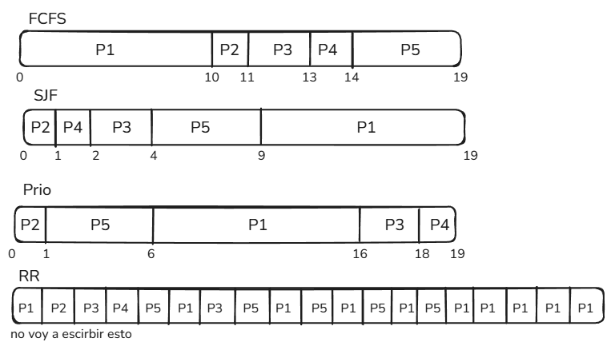

## Ejercicio 6

### a)

### b)

#### FCFS:
- Waiting time: (0 + 10 + 11 + 13 + 14)/5 = 11.6
- Turnaround: (10+11+13+14+19)/5 = 13.4
  
#### SJF:
- Waiting time: (9 + 0 + 2 + 1 + 4) /5 = 3.2
- Turnaround: (19 + 1 + 4 + 2 + 9) /5 = 7.4
  
#### Prio:
- Waiting time: (6 + 0 + 16 + 18 + 1)/5 = 8.2
- Turnaround: (16 + 1 + 18 + 19 + 6)/5 = 11.8

### RR:
- Waiting time: (0 + 1 + 2 + 3 + 4)/5 = 2
- Turnaround: (19 + 2 + 7 + 4 + 14)/5 = 9.2

### c) 
El menor waiting time lo tiene RR, el menor Turnaround lo tiene SJF, me parece q SJF es mejor.
